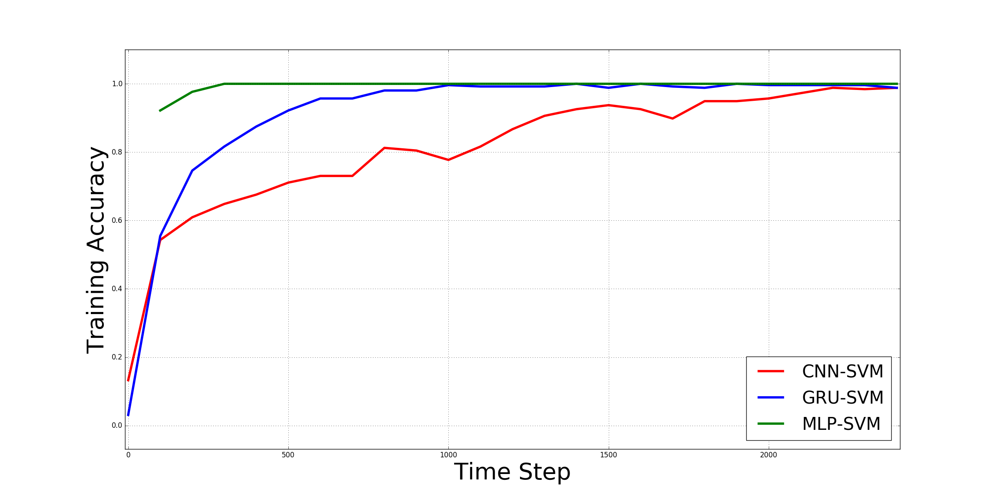

Lazarus 恶意代码家族分类识别命令行工具
===

python版本：`3.6.0`

实验环境: `Ubuntu 20.04.6 LTS  (WSL Version)`

参考文献 [arXiv.org](https://arxiv.org/abs/1801.00318).

## 项目简介

该项目旨在研究恶意代码家族分类识别。
我们设想利用深度学习力量构建智能反恶意软件系统模型。 使用此类模型将能够通过数学方法概括来检测新发布的恶意软件。

也就是说，找到给定恶意软件 *x* 与其相应恶意软件家族 `f : x → y `之间的关系。
为了实现这一目标，我们使用了 Malimg 数据集。首先我们将恶意软件二进制文件处理成灰度图像，接着然后我们在从灰度图导出特定大小的npz文件。然后我们通过训练以下深度学习模型来对每个恶意软件家族进行分类：CNN-SVM，GRU-SVM和MLP-SVM。经过我们的实验表明 GRU-SVM 在三个模型中脱颖而出。

本项目所用数据集，您可以从如下仓库下载 [`pt-datasets`](https://github.com/afagarap/pt-datasets),

```shell
$ pip install pt-datasets
```

## 使用方法

首先，请您克隆该项目到本地。

```bash
git clone https://github.com/xxxkkk578/Lazarus.git
```

请您先运行setup.sh来先确保程序具备运行环境。

```bash
$ sudo chmod +x setup.sh
$ ./setup.sh
```

运行`main.py`时，请您使用如下参数。您可以使用`-h`参数来获取如下的这段帮助。

```bash
usage: main.py [-h] -m MODEL -d DATASET -n NUM_EPOCHS -c PENALTY_PARAMETER -k
               CHECKPOINT_PATH -l LOG_PATH -r RESULT_PATH


██╗      █████╗ ███████╗ █████╗ ██████╗ ██╗   ██╗███████╗
██║     ██╔══██╗╚══███╔╝██╔══██╗██╔══██╗██║   ██║██╔════╝
██║     ███████║  ███╔╝ ███████║██████╔╝██║   ██║███████╗
██║     ██╔══██║ ███╔╝  ██╔══██║██╔══██╗██║   ██║╚════██║
███████╗██║  ██║███████╗██║  ██║██║  ██║╚██████╔╝███████║
╚══════╝╚═╝  ╚═╝╚══════╝╚═╝  ╚═╝╚═╝  ╚═╝ ╚═════╝ ╚══════╝
使用深度学习方法研究恶意代码家族识别

optional arguments:
  -h, --help            show this help message and exit

Arguments:
  -m MODEL, --model MODEL
                        [1] CNN-SVM, [2] GRU-SVM, [3] MLP-SVM
  -d DATASET, --dataset DATASET
                        指定数据集
  -n NUM_EPOCHS, --num_epochs NUM_EPOCHS
                        指定训练轮数
  -c PENALTY_PARAMETER, --penalty_parameter PENALTY_PARAMETER
                        指定惩罚参数
  -k CHECKPOINT_PATH, --checkpoint_path CHECKPOINT_PATH
                        指定保存训练模型的路径
  -l LOG_PATH, --log_path LOG_PATH
                        指定保存Tensorflow日志的路径
  -r RESULT_PATH, --result_path RESULT_PATH
                        指定保存训练结果的路径
```

下面是一段代码示例。

```bash
python main.py --model 1 --dataset ./dataset/malimg.npz --num_epochs 100 --penalty_parameter 10 --checkpoint_path ./checkpoint/ --log_path ./logs/ --result_path ./results/
```

如果您想要使用训练好的模型来识别，请使用`classifier.py` 并带上以下参数。

```bash
usage: classifier.py [-h] -m MODEL -t MODEL_PATH -d DATASET


██╗      █████╗ ███████╗ █████╗ ██████╗ ██╗   ██╗███████╗
██║     ██╔══██╗╚══███╔╝██╔══██╗██╔══██╗██║   ██║██╔════╝
██║     ███████║  ███╔╝ ███████║██████╔╝██║   ██║███████╗
██║     ██╔══██║ ███╔╝  ██╔══██║██╔══██╗██║   ██║╚════██║
███████╗██║  ██║███████╗██║  ██║██║  ██║╚██████╔╝███████║
╚══════╝╚═╝  ╚═╝╚══════╝╚═╝  ╚═╝╚═╝  ╚═╝ ╚═════╝ ╚══════╝
使用深度学习方法研究恶意代码家族识别

optional arguments:
  -h, --help            show this help message and exit

Arguments:
  -m MODEL, --model MODEL
                        [1] CNN-SVM, [2] GRU-SVM, [3] MLP-SVM
  -t MODEL_PATH, --model_path MODEL_PATH
                        指定使用的深度学习模型路径
  -d DATASET, --dataset DATASET
                        指定数据集路径
```

示例

```bash
python3 classifier.py --model 1 --model_path ./trained-cnn-svm/ --dataset ./dataset/malimg.npz
```

您可能得到的结果

```bash
Loaded trained model from trained-cnn-svm/CNN-SVM-2400
Predictions : [ 1. -1. -1. ..., -1. -1.  1.]
Accuracies : [ 0.99609375  0.94140625  0.94921875  0.984375    0.95703125  0.9296875
  0.9296875   0.9609375   0.9296875   0.94921875  0.953125    0.92578125
  0.89453125  0.8203125   0.8125      0.75390625  0.8203125   0.84375
  0.8515625   0.94140625  0.7421875   0.94140625  0.984375    0.9921875   1.
  0.99609375  0.9765625   0.9609375   0.81640625  0.98828125  0.7890625
  0.8828125   0.94921875  0.96875     1.          1.        ]
Average accuracy : 0.9203559027777778
```

如果您想生成图表来更好地观测结果，我们提供了`results_summary.py`供您使用。

```bash
usage: results_summary.py [-h] -r RESULT_PATH -t FIGURE_TITLE


██╗      █████╗ ███████╗ █████╗ ██████╗ ██╗   ██╗███████╗
██║     ██╔══██╗╚══███╔╝██╔══██╗██╔══██╗██║   ██║██╔════╝
██║     ███████║  ███╔╝ ███████║██████╔╝██║   ██║███████╗
██║     ██╔══██║ ███╔╝  ██╔══██║██╔══██╗██║   ██║╚════██║
███████╗██║  ██║███████╗██║  ██║██║  ██║╚██████╔╝███████║
╚══════╝╚═╝  ╚═╝╚══════╝╚═╝  ╚═╝╚═╝  ╚═╝ ╚═════╝ ╚══════╝
使用深度学习方法研究恶意代码家族识别

optional arguments:
  -h, --help            show this help message and exit

Arguments:
  -r RESULT_PATH, --result_path RESULT_PATH
                        指定存放结果的路径
  -t FIGURE_TITLE, --figure_title FIGURE_TITLE
                        指定混淆矩阵的标题
```

## 实验结果

**`表一`**

| 超参数                  | CNN-SVM | GRU-SVM                   | MLP-SVM         |
| -------------------- | ------- | ------------------------- | --------------- |
| Batch Size           | 256     | 256                       | 256             |
| Cell Size            | N/A     | [256, 256, 256, 256, 256] | [512, 256, 128] |
| No. of Hidden Layers | 2       | 5                         | 3               |
| Dropout Rate         | 0.85    | 0.85                      | None            |
| Epochs               | 100     | 100                       | 100             |
| Learning Rate        | 1e-3    | 1e-3                      | 1e-3            |
| SVM C                | 10      | 10                        | 0.5             |

**`表二`**



**`表三`**

| 变量名         | CNN-SVM     | GRU-SVM    | MLP-SVM   |
| ----------- | ----------- | ---------- | --------- |
| Accuracy    | 77.2265625% | 84.921875% | 80.46875% |
| Data points | 256000      | 256000     | 256000    |
| Epochs      | 100         | 100        | 100       |
| F1          | 0.79        | 0.85       | 0.81      |
| Precision   | 0.84        | 0.85       | 0.83      |
| Recall      | 0.77        | 0.85       | 0.80      |
